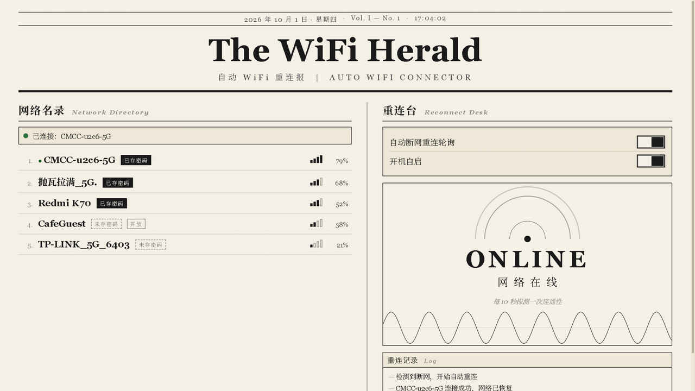
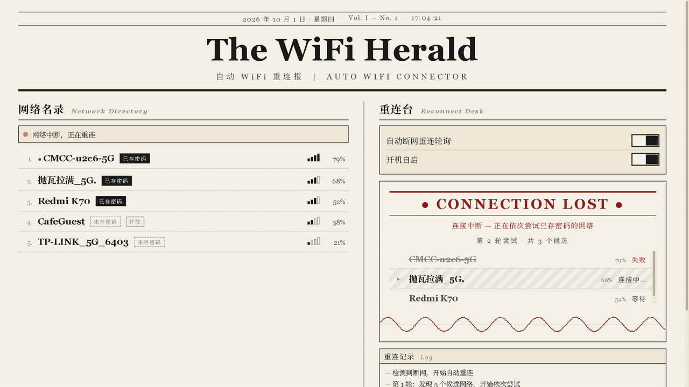
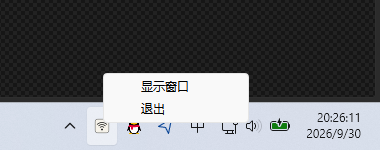

# Auto WiFi Connector

[](https://github.com/MisakaMikoto128/auto_wifi_connector/actions/workflows/ci.yml)
[](https://github.com/MisakaMikoto128/auto_wifi_connector/releases)
[](LICENSE)
[](https://misakamikoto128.github.io/auto_wifi_connector/)

<p>
  
  一个 Windows 桌面程序，解决「WiFi 已连接但无法访问互联网」以及「WiFi 关联意外断开」的问题。
  开启自动重连轮询后，程序周期性探测互联网连通性；判定断网时，取所有「可见且已保存密码」的 WiFi 网络，
  按信号强度降序依次尝试连接，直到网络恢复；一轮未恢复则等待后继续下一轮，直到成功为止。
</p>

界面采用纽约报刊排版风格（衬线字体、纸米底色、分栏布局），使用 Rust + Tauri 2 实现，UI 为无构建步骤的静态 Web 页面。

**下载**：从 [Releases](../../releases) 获取 Windows x64 压缩包，解压后直接运行，无需安装 Rust 环境。
**项目页**：<https://misakamikoto128.github.io/auto_wifi_connector/>

## 界面



左列为 WiFi 列表（名称、信号强度、是否已存密码、当前连接），右列为重连控制与状态动画。

断网发生时，右列切换为恢复过程视图：红色头条、候选网络依次高亮（连接中斜纹、失败删除线、成功反色）、底部滚动日志。



## 功能

- **连通性探测**：向多个固定的 HTTP 204/200 探测端点发起请求，结合 WiFi 关联状态综合判定在线与否；探测时间有界，网卡切换导致的 DNS 长时间阻塞不会使监控停摆
- **自动重连轮询**：断网时筛选「可见且已保存配置」的网络，按信号降序依次连接并验证，循环至恢复
- **系统托盘**：关闭窗口后隐藏到托盘继续运行，右键托盘图标可「显示窗口」或「退出」
- **开机自启**：默认注册，可在界面中关闭
- **实时界面**：WiFi 列表每 6 秒刷新，监控状态变化即时推送到界面

## 托盘



## 工作原理

```
每 10 秒: WiFi 已关联 且 任一探测端点可达?
  ├─ 是 → 保持监控
  └─ 否 → 进入恢复流程
           候选 = 可见网络 ∩ 已保存配置, 按信号降序
           对 each 候选:
             netsh wlan connect → 等待关联(≤12s) → 验证连通性
             成功 → 回到监控; 失败 → 下一个候选
           全部失败 → 等待 15s 开始下一轮
```

检测同时要求「WiFi 已关联」，是因为本机代理软件的虚拟网卡（TUN 模式）在 WiFi 物理断开后仍可能响应 HTTP 探测，仅做 HTTP 探测会误判为在线。

## 构建与运行

环境要求：Rust 1.77+、Windows 10/11（依赖 `netsh` 命令与 WebView2）。

```sh
cd src-tauri
cargo run          # 调试运行
cargo build --release
```

发布打包（需 `cargo install tauri-cli`）：

```sh
cd src-tauri
cargo tauri build  # 产出 NSIS 安装包与 exe
```

## 测试

```sh
cd src-tauri
cargo test                                        # 单元测试：netsh 输出解析、HTTP 状态行解析、候选筛选
cargo test --test live_reconnect -- --ignored     # 真实断网重连集成测试（会断开 WiFi 约 20 秒）
```

## 项目结构

```
src-tauri/src/
  wifi.rs      # netsh 扫描、已保存配置读取、连接（输出解析兼容中英文系统）
  netcheck.rs  # 零依赖最小 HTTP 连通性探测，时间有界
  monitor.rs   # 监控轮询与恢复流程状态机，向前端推送快照
  lib.rs       # Tauri 命令、托盘、关窗隐藏、开机自启
ui/            # 静态前端（报刊风格，无构建步骤）
tools/
  keepalive.py # 独立保底脚本：断网时重连到指定 WiFi，可单独使用
docs/          # GitHub Pages 与文档图片
tests/         # UI 预览页（mock 数据）与验证截图
```

## 主要参数（src-tauri/src/monitor.rs）

| 参数 | 值 | 说明 |
| --- | --- | --- |
| CHECK_INTERVAL | 10s | 连通性检测周期 |
| WIFI_LIST_INTERVAL | 6s | WiFi 列表刷新周期 |
| ASSOCIATE_TIMEOUT | 12s | 单次连接等待关联完成的超时 |
| ROUND_DELAY | 15s | 一轮候选全部失败后的等待 |

## 发布

推送 `v*` 形式的 tag 会触发 [Release 工作流](.github/workflows/release.yml)：自动构建 release 版本、打包并发布到 Releases。发布前请先更新 CHANGELOG.md 与 `src-tauri/Cargo.toml`、`src-tauri/tauri.conf.json` 中的版本号。

## 参与贡献

见 [CONTRIBUTING.md](CONTRIBUTING.md)。提交前请在本地通过 `cargo fmt`、`cargo clippy --all-targets -- -D warnings` 与 `cargo test`（与 CI 一致）。变更历史见 [CHANGELOG.md](CHANGELOG.md)。

## License

[MIT](LICENSE)
