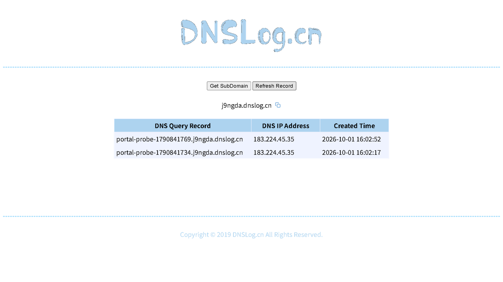

# 探究报告：portal 环境下的带外遥测可行性

日期：2026-10-01 · 状态：机制已实证，待真实 portal 环境验证

## 问题定义

设备已关联 WiFi（物理链路通），但因认证问题（captive portal 未认证）无法访问互联网。
在此状态下，能否通过这条受限连接将设备状态发送到远程服务器（远程遥测）。

## 候选通道分析

| 通道 | 原理 | portal 下可用性 | 结论 |
| --- | --- | --- | --- |
| DNS 隧道 | 数据编码为子域名查询，经递归解析到达自建权威服务器 | 多数 portal 放行 DNS（portal 依赖 DNS 引导用户到登录页）；部分 portal 劫持或完全阻断 DNS | **主选，已实证机制** |
| ICMP（ping） | 数据编码在 ICMP 载荷 | 部分网络放行 ICMP | 备选，未实证 |
| NTP（UDP 123） | 时间同步协议端口 | 少数网络放行 | 备选，未实证 |
| walled garden 白名单 | portal 常放行运营商站点、支付与系统域名 | 依赖具体 portal 策略 | 不稳定，不建议 |
| 局域网协作 | 同网段已认证设备代为转发 | 需要同网段有合作设备 | 超出当前范围 |

## 实证结果（2026-10-01，正常网络环境）

使用 dnslog.cn 带外平台验证 DNS 隧道机制：

1. 将模拟遥测数据编码为子域名 `awc-test01-direct-2235.j9ngda.dnslog.cn`，向公共递归 223.5.5.5 直接发起 UDP 53 查询
2. dnslog 记录显示该查询到达权威服务器（下图），来源为出口 IP 183.224.45.35/36



过程中发现的一个环境干扰：本机代理（TUN fake-ip 模式）会本地应答 DNS 查询导致数据不出公网；改为直接向公共递归服务器（223.5.5.5）发 UDP 53 后到达。这提示产品实现应直接向公共递归发查询，而不是依赖系统解析器。

## 探测工具

[tools/portal-probe.py](../tools/portal-probe.py) 用于在真实 portal 环境逐项检测通道可用性：

```
python tools/portal-probe.py <dnslog子域名>
```

检测项：WiFi 关联状态 / HTTP 连通性与劫持识别 / DNS 劫持对比（系统解析 vs 公共递归）/ 隧道实证查询。
当前在正常网络下全部通过；**需要在「只能打开内网网站」的那台电脑上运行一次**，拿到真实 portal 环境下的结果。

## 可行性结论

- DNS 隧道遥测**机制成立**：无需 TCP 连接、无需 HTTP 可达，仅需 DNS 查询能到达公网权威
- portal 环境是否放行 DNS 需要实测（portal-probe.py 的第 3、4 项直接回答此问题）
- 若 DNS 放行：可在所有 WiFi 候选均失败时进入遥测模式，向用户配置的域名周期性发送编码状态
- 若 DNS 被劫持或阻断：该网络下无法遥测，属物理限制

## 产品化设计（待用户确认后实施）

1. 配置文件 `%APPDATA%/com.autowificonnector.app/telemetry.txt`，内容为一行遥测域名（用户自有域名，NS 指向自建权威服务器；或 dnslog 类平台子域名）
2. monitor 在所有候选连续失败 N 轮后启用遥测：每 60 秒向 `<状态编码>.<遥测域名>` 发起 DNS 查询（直接向公共递归服务器，绕开本机代理）
3. 状态编码：`awc-<设备标识>-offline-round<N>`，单向发送，不接收指令
4. 默认关闭：配置文件不存在则不启用
