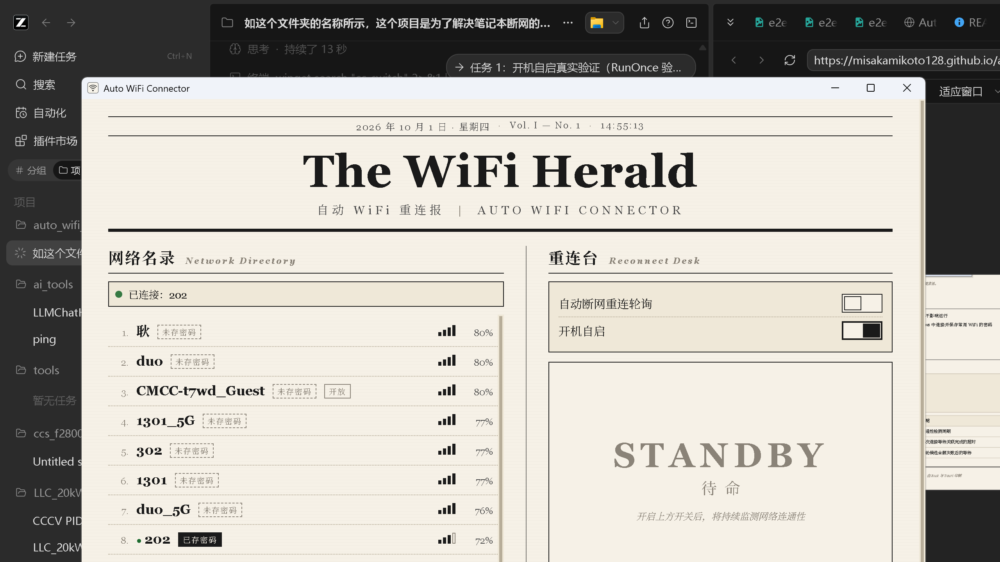

# 任务汇报 — 2026-10-01

## 任务 1：开机自启真实验证

### 已完成

1. **注册表静态验证**：`HKCU\Software\Microsoft\Windows\CurrentVersion\Run` 存在 `Auto WiFi Connector` 项，路径指向 release 版 exe，目标文件存在。
2. **模拟登录环境启动验证**：以 explorer 启动 Run 项的相同方式（工作目录为用户配置文件目录、无父控制台）启动程序，进程存活、窗口正常、关窗后转入托盘运行。
3. **过程中发现的机制事实**：重启 explorer.exe 不会重新执行 Run 项（现代 Windows 仅在登录时处理），因此最终验证必须真实注销或重启。

### 待完成（需要重启电脑）

已在 `HKCU\...\RunOnce` 布置一次性验证脚本 [tools/verify-autostart.ps1](../tools/verify-autostart.ps1)。下次登录后它会自动：等待 20 秒 → 检查 auto-wifi-connector.exe 进程 → 结果写入 `tests/autostart-verify.txt` 并截屏存证 `tests/autostart-verify.png` → 自我删除。

**请重启电脑（或注销再登录）**，完成后告诉我，我读取结果文件确认。

## 任务 2：Windows Defender 弹窗调研

### 实证结果

| 对象 | Authenticode 签名 | 备注 |
| --- | --- | --- |
| 本程序 auto-wifi-connector.exe | NotSigned | 含版本资源（ProductName、FileVersion） |
| cc-switch.exe v3.20.4 | NotSigned | 同样未签名，已上架 winget（`farion1231.CC-Switch`） |

结论：cc-switch 不弹提示的原因不是签名，而是其下载量已建立 SmartScreen 声誉，且有 winget 分发渠道。新发布的未签名程序在 SmartScreen 声誉系统中没有记录，首次运行会提示「Windows 已保护你的电脑」。

本机复现测试：对 exe 附加完整 MOTW（模拟浏览器下载的网络来源标记）并以 ShellExecute 启动，本机未弹提示——本机的默认设置不拦截此类文件，弹窗行为因机器设置与文件声誉而异。

### 解决方案（按可行性排序）

1. **文档说明（已实施）**：README 与 GitHub Pages 增加安装说明，告知 SmartScreen 提示的处理方法（更多信息 → 仍要运行）。
2. **SHA256 校验（已实施）**：Release 流水线自动生成并上传 `.sha256` 文件，用户可用 `certutil -hashfile` 核对下载完整性。
3. **SignPath.io 免费开源签名（建议下一步）**：SignPath Foundation 为符合条件的开源项目（公开仓库、OSI 许可、活跃开发）提供免费 OV 代码签名，可接入现有 Release 流水线。申请地址：https://signpath.io。签名后可快速建立 SmartScreen 声誉。
4. **winget 分发（建议下一步）**：向 microsoft/winget-pkgs 提交清单，用户可用 `winget install` 安装。cc-switch 即采用此渠道。
5. **EV 代码签名证书（付费）**：约 $300-500/年，签名后立即免除 SmartScreen 提示。
6. **Azure Trusted Signing（付费）**：约 $10/月，微软官方签名服务，签名即被 SmartScreen 信任。
7. **Microsoft Store（MSIX 上架）**：商店分发完全不经过 SmartScreen，需开发者账号（$19 一次性）与审核流程。

### 已随 v0.2.2 发布

- [auto-wifi-connector-v0.2.2-windows-x64.zip](https://github.com/MisakaMikoto128/auto_wifi_connector/releases/download/v0.2.2/auto-wifi-connector-v0.2.2-windows-x64.zip)
- 随附 `.sha256` 校验文件，流水线验证通过（CI + Release 均绿）

## 附带证据：中文名称乱码修复生效

v0.2.1 运行实拍：WiFi 名录第一行「耿」（UTF-8 编码的 SSID）显示正常，修复前该名称显示为乱码。
